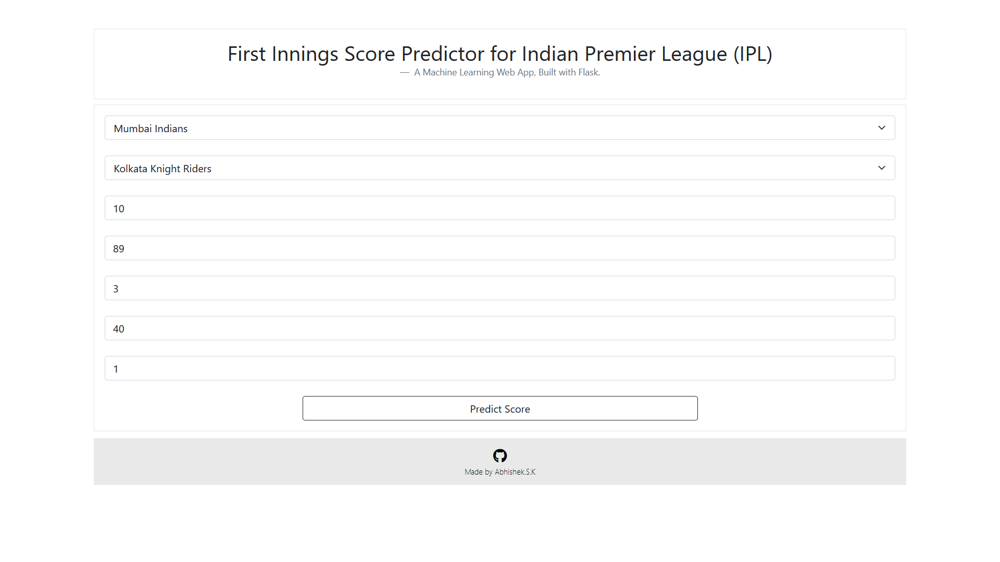

# IPL Score Prediction
 
* IPL score prediction with Machine Learning
* Deployed on Heroku at - https://cricketscorepredicter.herokuapp.com/
* Notebook : https://github.com/abhisheksk24/IPL-score-prediction/blob/master/notebook/crickscore.py
* Dataset : https://github.com/abhisheksk24/IPL-score-prediction/blob/master/notebook/ipl.csv
# Sample Screenshots
<table>
  <tr>
    <td>Input Page</td>
  </tr>
 <tr>
 <td></td>
 </tr>
  <tr>
    <td>Output Page</td>
  </tr>
 <tr>
 <td></td>
 </tr>
</table>

# Contact
* Email
034abhi@gmail.com
